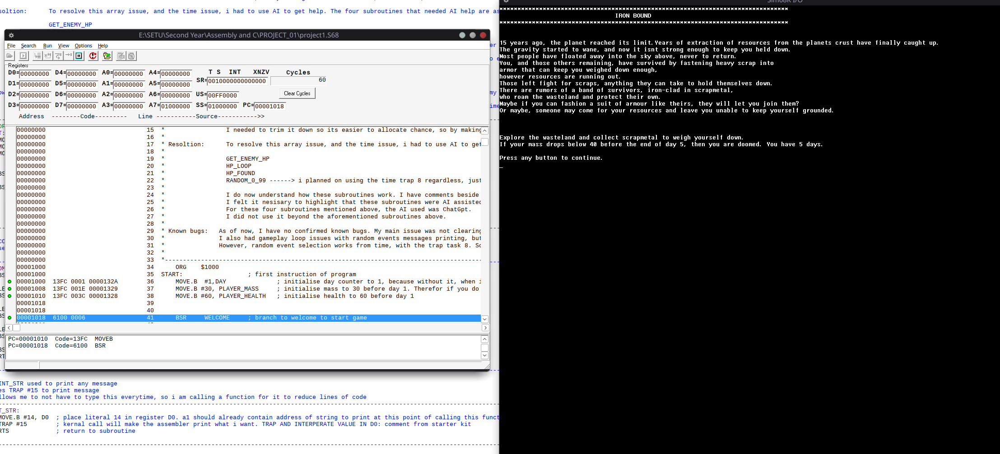
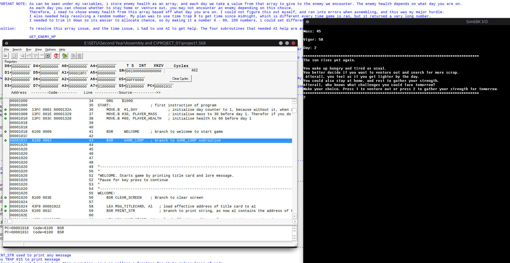

# 68K-Assembly-Text-Based-Game
This was my first project using assembly. In this project, I created a text based adventure game using Motorola 68K assembly. 
I created this using the Easy68K IDE, which I ran using Wine as I normally use Linux based machines.

This is a text based game, following the theme of Alternative Physics. The game itself is meant to be simple, as this project is simply a matter of showcasing how you can move variables around in assembly.
For this project, we used 68K assembly, as it was a better learning ground than going straight into x86, due to their being far less registers. 
One thing I learned from this project, was how if you change just one bit in the program, the entire programs outcome could change. This reinforced how important a basic understanding of assembly is to anyone who wished to study Cyber security, and that was the true aim of the project.

# Iron Bound
 
A text-based survival adventure game written in Motorola 68K assembly, built for the *Assembly and C* module at SETU Carlow. This was my first assembly project and my first time designing a game from scratch.
 
## Premise
 
Fifteen years after gravity itself starts failing on your planet, survival means staying heavy enough not to float away. You have five days to scavenge scrap metal, fight off rival survivors, and manage your **mass** (keeps you grounded) and **vigor** (your combat health) — all while deciding each day whether to risk venturing out or rest and recover.
 
## Core Mechanics
 
- **Mass** is the win condition: drop below 40 at the end of any day and you float away (bad ending). End Day 5 at 75+ mass for the good ending; anywhere from 40–74 gets a neutral ending.
- **Vigor** is your combat stat: reach 0 and you're killed by another scavenger.
- Each day, choose to **venture out** (risk combat, gain mass on a win) or **rest** (fully restore vigor, but waste the day).
- Combat is a straight vigor comparison against a per-day enemy — enemy strength is pulled from a lookup table (`ENEMY_HP_TABLE: DC.B 55,65,70,75,85`) that gets tougher day by day.
- From Day 4 onward, a random event can fire each day (weighted: 1% instant game-over, 20% mass loss, 30% "lucky find" mass/vigor boost) — each event is flag-gated so it can only trigger once per playthrough.

## Technical Notes
 
- **RNG:** No hardware RNG available, so `RANDOM_0_99` pulls the system's time-since-midnight (TRAP #8), then uses `DIVU`/`SWAP`/`ANDI` to fold it down into a 0–99 range for percentage-based event checks.
- **Enemy scaling:** `GET_ENEMY_HP` walks the day-indexed lookup table to pull that day's enemy stat, adjusting for the array being 0-indexed while the day counter starts at 1.
- **A real bug I hit and fixed:** loading a byte into a register without clearing it first left garbage in the upper bits (health/mass would print as something like `65000`). Fixed by `CLR.W` before every `MOVE.B` into a register I was about to print or compare.
- **AI use, disclosed honestly:** I used ChatGPT for help with four subroutines I couldn't work out alone — the day-indexed array lookup (`GET_ENEMY_HP`, `HP_LOOP`, `HP_FOUND`) and the RNG range-trimming logic (`RANDOM_0_99`). Everything else is my own work. I've kept this noted directly in the source header and inline comments, and I understand how all four subroutines work — I just needed help figuring out the approach initially.

## Flow
 

 
The full day/decision loop, combat resolution, and ending checks are mapped out above (hand-drawn during planning).
